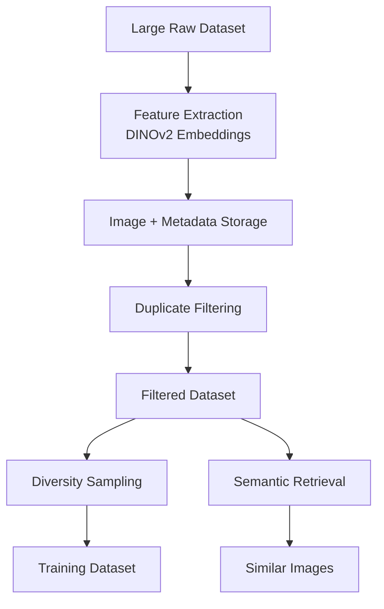

# Dataset curation pipeline + Targeted Dataset Retrieval

A scalable pipeline for transforming large, noisy image datasets into high-quality training datasets using modern vision embeddings and vector similarity search.

This system processes millions of images and removes duplicates and near-duplicates, and selects a **diverse subset of images** suitable for training machine learning models.

In addition to filtering and sampling datasets, the pipeline also supports **targeted image retrieval**. This allows users to retrieve images from the dataset that are **semantically similar to a candidate image or folder of images.** This is useful when training models that require targeted examples of a specific object, environment, or failure cases.

The pipeline leverages vision models like Meta AI's DINOv2, pgVector, and sampling algorithms used in machine learning infrastructure.

# How to use

How to set up the repo: [Repo and Database setup](repoguide/SETUP.md).

Admin provisioning/bootstrap: [Admin setup](repoguide/SETUPadmin.md).

Production ownership/access handoff: [Production handoff runbook](repoguide/PROD_HANDOFF.md).

How to use from CLI: [How to use](repoguide/HOWTOUSE.md).

# Problem Context


Many machine learning systems rely on large image datasets collected from real-world environments. These datasets often contain:

- near-duplicate images
- poor quality frames
- redundant samples
- heavy class imbalance
- large volumes of unlabelled data

In my particular use case, our robotics camera system can capture millions of images, but only a small subset may be useful for training. 

Training on unfiltered datasets introduces several issues:

### 1. Duplicate images

Datasets often contain many identical or near-identical images captured in sequence. Training on these adds no new info, wastes compute, and **risks overfitting the model.**

### 2. Lack of Diversity

Even after deduplication, many datasets still lack visual diversity, which can lead to models overfitting. The unfiltered dataset may also be unbalanced, in the sense that there may be considerably more images of object/environment A, compared to B, which would cause the model to overfit.

### 3. Dataset Scale

It will take someone days/weeks to manually select the best dataset to train on when we reach hundreds of thousands of images. A scalable automated filtering pipeline that can remove duplicates, store embeddings for efficient similarity search, select a maximally diverse subset of images, and support cloud-scale storage and processing is necessary.

# Functional Requirements

- Large-scale dataset Processing
  * The system should be capable of processing hundreds of thousands to millions of images efficiently
* Automated Dataset Curation
  * Should automatically
    * remove duplicates
    * select diverse samples
    * produce training-ready datasets   
- Image Ingestion
  * Pipeline must support Images stored either locally on disk or in cloud object storage (AWS S3)
* Cloud Integration
  * Images may be stored in AWS S3 and AWS RDS (or other cloud PostgreSQL servers)
* Incremental Processing
  * New images can be added to an existing dataset without reprocessing the entire dataset
* Semantic Retrieval
  * Must allow users to retrieve images that are semantically similar to a candidate image or folder of images
 
# Non-Functional Requirements

* Scalability
  * Pipeline should scale to datasets containing 100K - 1m+ images
* Performance
  * Should use efficient methods since we are working with huge scale:
    * Vectoring Embedding processing (GPU Batch Processing)
    * Vector Database Querying (HNSW)
    * Image copying (S3 server side copy)
* Cost and Storage Efficiency
  * While not the most important for my use case, as this bill is going on the company, should still be mindful
* Security
  * Images or metadata should not be accessible to non authorized
  * Properly set up IAM and security groups

# Proposed Solution and System Overview

The pipeline converts a large unfiltered image dataset into a filtered, deduped dataset, then allows retrieval of a curated training dataset or a semantic image retrieval through the following stages:


# Core Technologies

| Category                | Technology            | Purpose                                         |
| ----------------------- | --------------------- | ----------------------------------------------- |
| Programming Language    | Python                | Main pipeline implementation                    |
| Deep Learning Framework | PyTorch               | Running vision models and generating embeddings |
| Vision Model            | DINOv2                | Semantic image embeddings          |
| Vector Database         | PostgreSQL + pgvector | Embedding storage and similarity search         |
| Cloud Storage           | AWS S3                | Storing filtered image datasets         |
| Image Processing        | OpenCV / Pillow       | Image loading and preprocessing                 |
| Data Processing         | NumPy                 | Vector math            |


# Feature Extraction

As an input, this system processes images stored locally or in AWS S3. Images are processed in batches (to maximize GPU util) using PyTorch. 

The system loads a pretrained DINOv2 Vision Transformer and extracts embeddings for each image. In my specific use case, I have also decided to add an option for segmentation preprocessing. This is currently done using a custom Roboflow segmentation model to generate polygon points around the subject of interest. Helpers will then convert the polygon into a binary mask and crop the image by setting the background outside the subject to black.

The embedding pipeline performs:

1. Image loading
2. Optional segmentation preprocessing
3. Image normalization
4. Feature extraction
5. Normalize to unit vectors while preserving direction (L2 normalization)

Produces vectors of dimensions 768

# Duplicate Filtering

Each embedding is inserted into the vector database only if it is sufficiently different from existing images.

With pgvector, we can perform a nearest neighbor search:
```
SELECT ID, embedding <+> query_vector
ORDER BY embedding <+> query_vector
LIMIT 1
```

if the cosine similarity exceeds the threshold:
```
cosine_similarity >= 0.98
```
The image is discarded and considered a duplicate. Otherwise, the image is copied to the filtered dataset (copied fast across the server with S3), and embedding is inserted into the database.

allows the database to grow without accumulating redundant images.

# Dataset Sampling

Once a filtered dataset is constructed, this repo provides a diversity sampling pipeline and an image retrieval pipeline.

### Diversity Sampling

Select a subset of k images using farthest point sampling (k-center).

**Algorithm outline (Gonzalez algorithm)**
1. Randomly select an initial image
2. Compute Distances to all other images
3. Select the image farthest from the current set
4. Mark that image as selected
5. Reapt until K images are selected

This greedy approach approximates the k-center optimization problem, producing a subset with maximal diversity.
Note: our vector query uses HNSW, reducing search complexity from O(N) to O(logN)

### Semantic Retrieval System

Functionality allows users to retrieve k images from the dataset that are semantically similar to a candidate image or folder of images. 

**Workflow is as follows**
1. Generate embeddings for the candidate set (using the same embedding model) and compute a mean embedding vector.
2. Query the vector database for the K nearest images
3. Download matching images from S3.

This feature also turns the dataset into a semantic image search engine, enabling efficient data exploration.

# Design Decisions

### Why use a vector Database

A vector database allows efficient similarity search over high-dimensional embeddings. 

For example, without a vector index, duplicate detection would require O(N) comparisons against all images

A vectorDB with Hierarchical Navigable Small Worlds (HNSW) indexing makes querying nearest neighbors approximately O(log N).

### Why pgvector

Because we are using Postgres already to store other metadata related to the image (like S3 key, date upload, etc.), pgvector integrates directly with PostgreSQL.

This makes our cloud infrastructure much simplier as well as we don't need to host a separate vector DB instance. 

PostgreSQL is also significantly cheaper than most vector databases, like Pinecone (probably around 75% cheaper).

While it is a little slower, the performance is still good enough for <1M vectors.

### Why Cloud Storage (S3, RDS)

Mostly done for scalable storage, easy integration with ML pipelines, fast server-side copy operations, and distributed access.

# Scaling Considerations

### Feature extraction

Embedding generation is the most computationally expensive stage. We try to improve it with batch GPU inference.

With a GPU, typical performance is anywhere from 40-100 images/sec.

### Vector Search

Each image requires a nearest neighbor search.

Using HNSW indexing:
`≈ O(log N)`

### Sampling Complexity

Farthest point sampling runs in `O(N * K)` where
```
N = number of images in dataset
K = number of samples
```

**VERY IMPORTANT MEMORY CONSIDERATION**

In order to run K-center, we first load the filtered embeddings into memory. Embeddings are stored as float32. This could be memory-heavy when scaled to hundreds of thousands of embeddings

For example, if:
```
N = 300,000
d = 768
float32 = 4 bytes
```

Memory usage is around 921 MB. 

Now this will work on beefy computers, but it will still be questionable when reaching millions of images. 

As a future consideration, we can have a hard cap candidate pool (let's say 300k embeddings) when running k-centers, meaning we will just randomly select 300k of the images, and then run k-centers on those images. Can also store as float16 if possible.

# Open Questions

What is the optimal similarity threshold?
